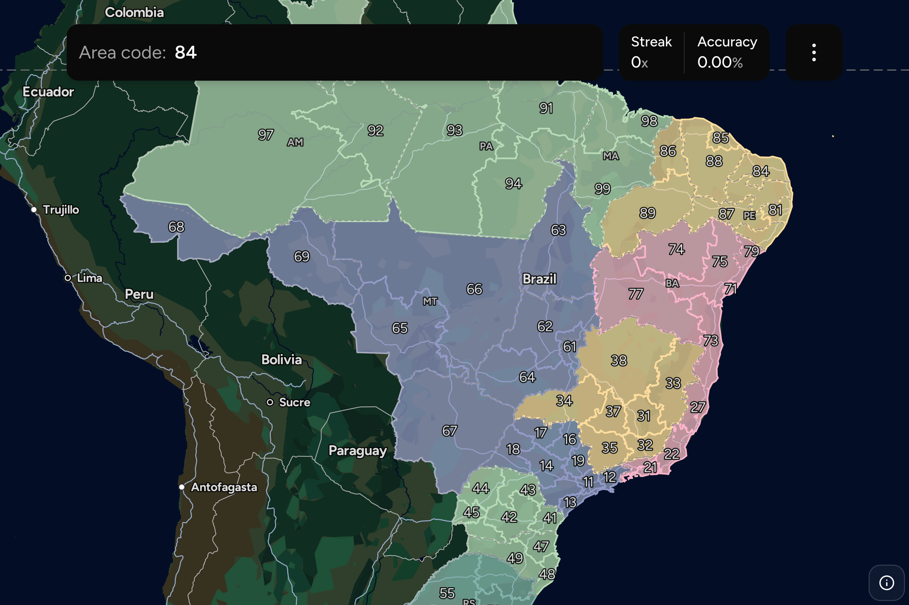

# Simple & fun map games

A collection of map-based games, to which I (plan) to add new ones occasionally. Most games use a canvas-based renderer I wrote, based on mapping data I combined and transformed to the right format. This is reflected in this repository, where `web` is the Next.js app which runs the games, and `mapgen` is a Python project used to create the map data.

# Contributions

Contributions are welcome! If you'd like to add a new game or improve an existing one, please fork the repository and submit a pull request. Make sure to include a clear description of your changes. For questions or suggestions, feel free to open an issue. Do discuss upfront when it is a bigger change, to make sure we can align your work and don't waste your time.

# License

This project is licensed under the MIT License. See the [license](license) file for details.

# Screenshots

